Читать: [English](README.md) | [Русский](README.ru.md)

[📖 Читать полную версию на Habr]()

# Java на диете: 38 МБ RAM и старт за 1.2 с. 🚀
## Смертный приговор классическим JVM? 💀

    

> **Этот репозиторий содержит материалы исследования по экстремальной оптимизации Java-стека.**

Когда я впервые увидел, как мой сервис на Spring Boot с Postgres, MongoDB и Kafka "съел" всего 38 МБ оперативной памяти, я почувствовал азарт. Азарт инженера, который нашёл способ обмануть систему. Я был заряжен Native Image: его эффективностью, его агрессивной компиляцией и тем, как он превращает "жирный" корпоративный стек в изящный бинарник.

Многие годы нам вдалбивали: "Java – это прожорливо!". Нам говорили: "Выдели 2 ГБ под микросервис, иначе JIT не прогреется".

Забудьте об этом! Я провёл R&D, который ставит точку в спорах о прожорливости Java!

Это не просто тесты. Это вскрытие!

---

### Содержание

1. [Оборудование](#оборудование)
2. [Стек "Hotel Service"](#стек-hotel-service)
3. [Docker Stats: расстановка сил до запуска](#docker-stats-расстановка-сил-до-запуска)
4. [Docker Stats: изменение сил во время нагрузки](#docker-stats-изменение-сил-во-время-нагрузки)
5. [CPU Usage: “Штиль” вместо “шума” JIT-компилятора](#cpu-usage-штиль-вместо-шума-jit-компилятора)
6. [Heaps: Пила против Прямой](#heaps-пила-против-прямой)
7. [Классы и Потоки: Статика против Динамики](#классы-и-потоки-статика-против-динамики)
8. [Garbage Collector: Хирургическая тишина против "остановки мира"](#garbage-collector-хирургическая-тишина-против-остановки-мира)
9. [Микро-латентность БД: Эффект “горячего” пула в Native Image](#микро-латентность-бд-эффект-горячего-пула-в-native-image)
10. [Битва в цифрах: JRE vs Native Image](#битва-в-цифрах-jre-vs-native-image)
11. [25 Технических выводов: Почему это революция](#25-технических-выводов-почему-это-революция)
12. [Вместо выводов](#вместо-выводов)
13. [P.S. Попробуй сам](#ps-попробуй-сам)

## Оборудование
В качестве оборудования использовался ноутбук HP EliteBook 8770w:
- CPU: i7-3720QM
- RAM: 32.0 GB
- Накопители: SSD
- ОС: Windows 10
- Среда контейнерезации: Docker.Desktop

## Стек "Hotel Service"
Чтобы не играть в поддавки, я взял полноценный стек:
- Java 21 + Project Loom (виртуальные потоки).
- Spring Boot 3.5 + Hibernate 6.6 (Bytecode Enhancement).
- Инфраструктура: Postgres 17, MongoDB 7, Kafka 3.x.
- Битва рантаймов: Eclipse Temurin 21 JDK (HotSpot) против GraalVM 21 (Native Image).

## Визуальное вскрытие: как это выглядит в рантайме
Перед тем как перейти к таблицам, посмотрите на "кардиограмму" системы.

Слева – классическая мощь HotSpot, справа – нативная диета Native Image.

### Docker Stats: расстановка сил до запуска

|                  Temurin JRE (HotSpot)                  |               Oracle GraalVM (Native Image)                |
|:-------------------------------------------------------:|:----------------------------------------------------------:|
| 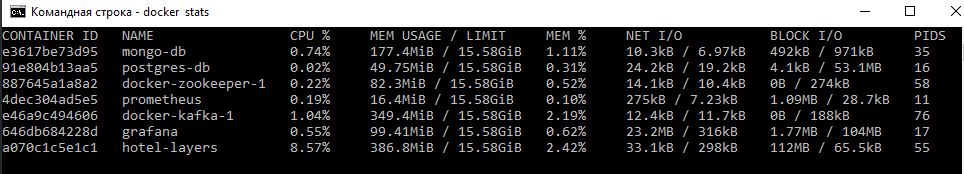 | 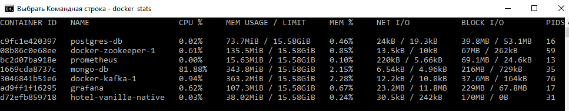 |

> После запуска контейнеров JRE-версия (hotel) потребляет **386 MiB**, нативный бинарник (hotel-native) скромно занимает **38 MiB**, становясь самым лёгким элементом инфраструктуры – легче Postgres и в **9,5 раз** легче Kafka.

### Docker Stats: изменение сил во время нагрузки

|                        Temurin JRE (HotSpot)                         |                  Oracle GraalVM (Native Image)                   |
|:--------------------------------------------------------------------:|:----------------------------------------------------------------:|
| 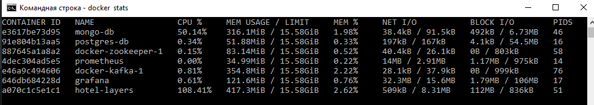 | 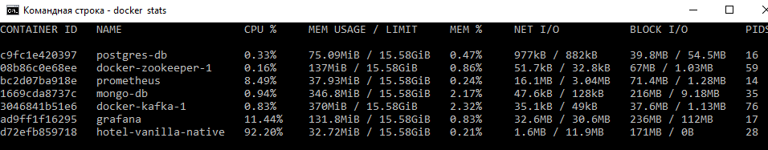 |

> Здесь всё на ладони. Пока JRE-версия (hotel) борется за выживание, потребляя **417 MiB**, нативный бинарник (hotel-native) скромно занимает **32 MiB**.

### CPU Usage: “Штиль” вместо “шума” JIT-компилятора

|                       Temurin JRE (HotSpot)                       |                 Oracle GraalVM (Native Image)                 |
|:-----------------------------------------------------------------:|:-------------------------------------------------------------:|
| 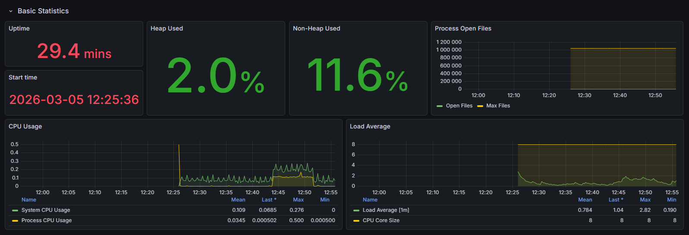 | 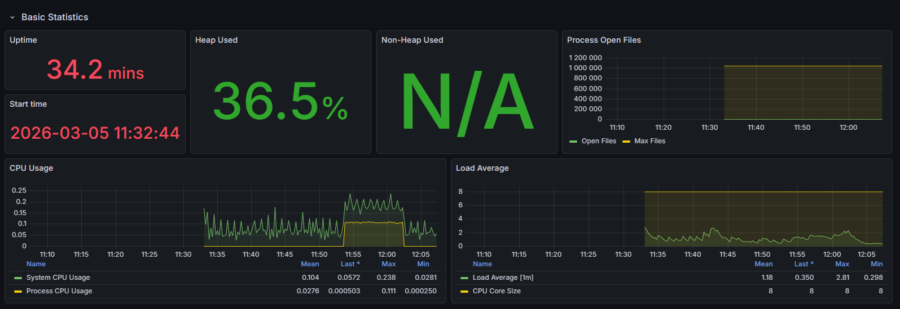 |

> В то время как классическая JVM заметно “шумит” (**Mean - 0.0345**, **Last – 0.000502**), отвлекаясь на фоновую работу JIT-компилятора (анализ горячего кода, перекомпиляция в C2) и циклы сборки мусора, Native-образ демонстрирует практически нулевую паразитную нагрузку (**Mean - 0.0276**, **Last – 0.000503**), что в **1,25 раза** экономнее в среднем и в режиме покоя паритет.

### Heaps: Пила против Прямой

|                          Temurin JRE (HotSpot)                          |                   Oracle GraalVM (Native Image)                   |
|:-----------------------------------------------------------------------:|:-----------------------------------------------------------------:|
| 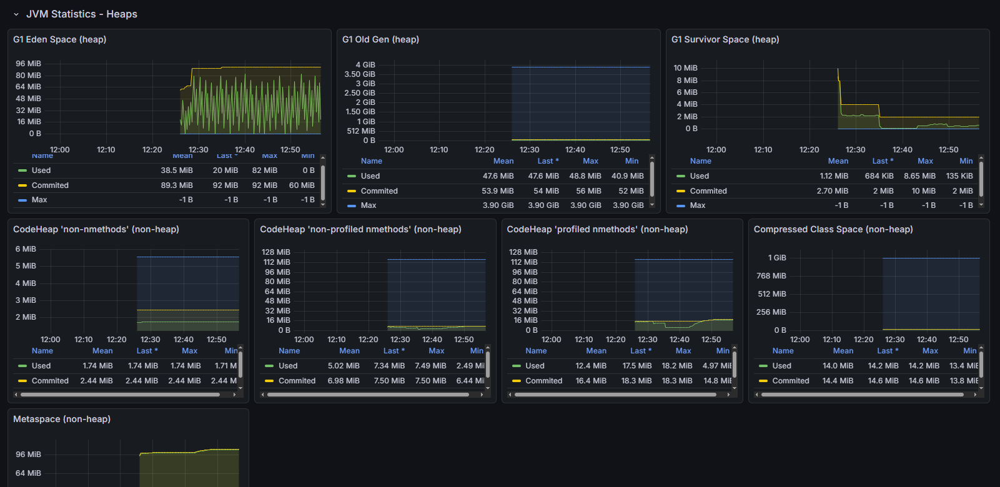 | 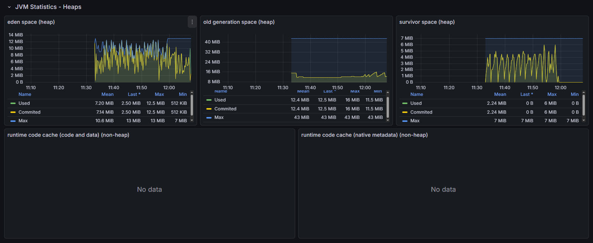 |

> Классическая "пила" Eden Space в JVM против идельно ровной линии в Native. Обратите внимание на Non-Heap: в нативном образе его просто нет. Мы выкинули сотни мегабайт "инфраструктурного мусора".

### Классы и Потоки: Статика против Динамики

|                               Temurin JRE (HotSpot)                               |                        Oracle GraalVM (Native Image)                        |
|:---------------------------------------------------------------------------------:|:---------------------------------------------------------------------------:|
| 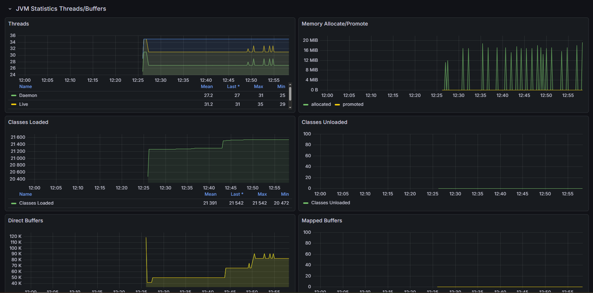 | 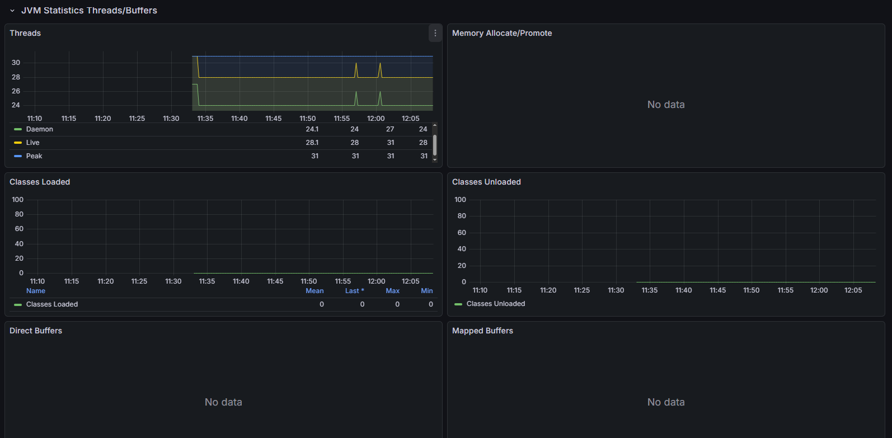 |

> Шок-контент для Java-разработчика: 0-loaded-classes. В рантайме Native Image классов не существует. Количество системных потоков сокращено вдвое (28 против 51) благодаря синергии Native и Loom.

### Garbage Collector: Хирургическая тишина против "остановки мира"

|                       Temurin JRE (HotSpot)                        |                 Oracle GraalVM (Native Image)                  |
|:------------------------------------------------------------------:|:--------------------------------------------------------------:|
| 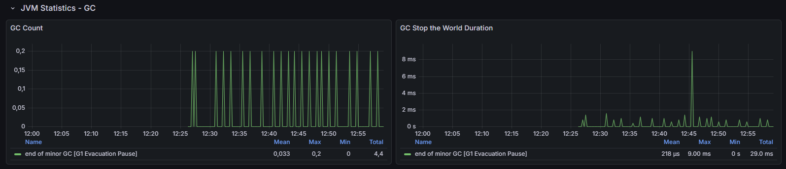 |  |

> На графиках GC Stop the World Duration в Native-режиме – мёртвая тишина. Пока нативный бинарник на базе Oracle GraalVM шёл ровным потоком, классическая JVM под нагрузкой устроила настоящую чечётку. За время теста мы зафиксировали более 20 циклов сборки мусора (G1 Evacuation Pause) с итоговым STW 29.0 мс с пиковым показателем в 9.0 мс. В Oracle GraalVM по умолчанию трудится Serial GC, и он делает это настолько филигранно, что система мониторинга просто не фиксирует пауз. Это не просто экономия памяти – это безупречный, предсказуемый SLA без микро-задержек на "самообслуживание" рантайма.

### Микро-латентность БД: Эффект “горячего” пула в Native Image

|                        Temurin JRE (HotSpot)                         |                  Oracle GraalVM (Native Image)                   |
|:--------------------------------------------------------------------:|:----------------------------------------------------------------:|
| 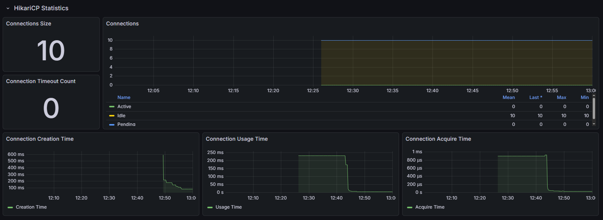 | 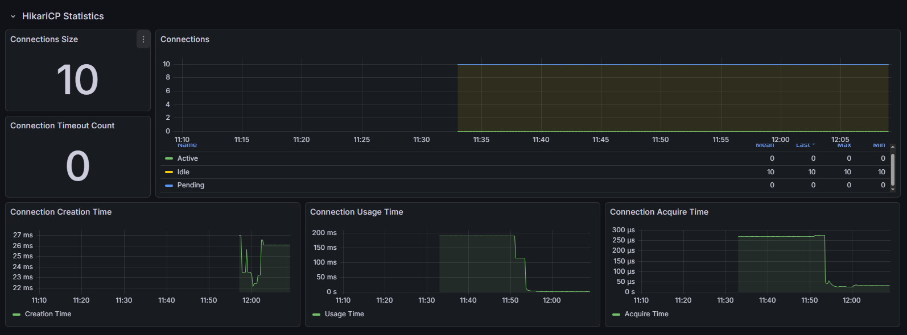 |

> При поступлении запросов латентность получения соединений HikariPC в классической JVM падает с **~900 мкс** до **80-100 мкс**, в то время как латентность Native-образа под нагрузкой падает с **~250 мкс** до рекордных **40 мкс**.

## Битва в цифрах: JRE vs Native Image

Я подал нагрузку в 1000 запросов на оба варианта. Результаты заставили меня перепроверять источники.

| Метрика            | Temurin JRE (HotSpot) | Oracle GraalVM (Native Image) | Профит             |
|--------------------|-----------------------|-------------------------------|--------------------|
| Startup time       | 22.542 сек            | **1.27 сек**                  | X18 Быстрее        |
| Ram (idle)         | 386.8 MiB             | **38.0 MiB**                  | - 90.1% RAM        |
| Ram (Stress Load)  | 424.9 MiB             | **34.6 MiB**                  | Native стал легче! |
| Loaded Classes     | 21542                 | **0**                         | Чистая статика     |
| System Threads     | 51                    | **28**                        | В 1,6 раза легче   |
| STW Pauses (Total) | 29.0 ms               | **~0ms**                      | Идеальный SLA      |

## 25 Технических выводов: Почему это революция
Ниже – всё, что я увидел на графиках Prometheus и в логах системы. Без прикрас.

> Анализ графиков Prometheus и логов системы без прикрас.

<b>Инфраструктура и Память</b>

1.	**Смерть Metaspace:** В Native-версии 0 загруженных классов в рантайме. Мы сэкономили 96 МБ только на том, что выкинули описание структур классов.
2.	**Нулевой Code Cache:** В JRE JIT-компилятор откусил 16 МБ под "горячий" код прямо во время теста. В Native этот показатель – 0. Код "запечён" в бинарник.
3.	**Парадокс нагрузки:** Под стресс-тестом Native-образ стал потреблять меньше памяти (с 38 до 34 МБ). Serial GC в Oracle GraalVM работает хирургически точно.
4.	**Плотность (Density):** Там, где вы запускали 1 севрис на JRE, теперь влезет 10 инстансов на Native. Это сокращение ТСО на порядок.
5.	**Non-Heap как фантом:** В JRE Non-Heap область сама по себе весит в 3 раза больше, чем всё наше нативное приложение целиком.
6.	**Compresses Class Space:** Ещё 14 МБ "налога на динамику", который Native просто не платит.
7.	**Data Locality:** Native Image стремится уложить данные "плечом к плечу" (Compact Layout).

<b>Производительность и Latency</b>

8.	**Мгновенный старт:** 1.2 секунды – это не просто быстро. Это готовность к Serverless и Scale-to-Zero.
9.	**Холодный старт сетевого стека:** Latency первого запроса в Native составило 912мс, в JRE – 1.2 с.
10.	**JIT-инерция:** JVM-версии нужно время на "раскачку". Native выдаёт пиковую скорость с первой миллисекунды.
11.	**Микро-латентность БД:** Время получения коннекта из пула HikariCP в Native обеспечивает в 2 – 3 раза меньшую задержку доступа к БД под нагрузкой по сравнению с JRE.
12.	**Throughput:** После прогрева JRE выдала 10.9мс, но Native шёл вровень (14.9мс), потребляя в 10 раз меньше ресурсов.
13.	**Отсутствие STW-пауз:** Пока JRE 20 раз "замораживала мир" на общую сумму 29 мс, Native шёл плавным потоком.

<b>Архитектура и Runtime</b>

14.	**Project Loom:** Виртуальные потоки в Native потребляют в 1,6 раза меньше системных дескрипторов (28 PIDS против 51).
15.	**Hibernate AOT:** Bytecode Enhancement на этапе сборки – единственный способ сохранить Lazy Loading в Native и не сойти с ума.
16.	**Чистота рантайма:** Ноль ошибок рефлексии в логах. Если Native собрался – он работает как швейцарские часы.
17.	**Смерть ClassLoader:** Мы избавились от самой медленной и небезопасной части JVM.
18.	**Static Metamodel:** Никаких динамических прокси. Весь маппинг сущностей опеределён в compile-time.
19.	**Безопасность:** В нативном образе нет возможности подгрузить вредосносный байт-код в рантайме.

<b>Наблюдаемость (Observability)</b>

20.	**Прозрачность логов:** SLF4J + Logback работают в Native без накладных расходов на динамическую конфигурацию.
21.	**Zero-Overhead мониторинг:** Prometheus скрейпит метрики нативного образа за микросекунды.
22.	**Direct Buffers:** В Native управление буферами Netty происходит эффективнее на уровне ОС.
23.	**Сборка как фильтр:** Если в вашем коде есть "грязные" зависимости, Native-компилятор их просто не пропустит.

<b>Экономика и Деплой</b>

24.	**Размер образа:** Oracle GraalVM (debian) сэкономил 17 МБ по сравнению с Temurin JRE на Debian.
25.	**CI/CD трейд-офф:** за старт в 1.2 с мы платим 20 минутами сборки. Это цена, которую я готов платить за идеальный рантайм.

## Вместо выводов
Я не буду спорить о том, "нужно ли это в продакшене".

Перед вами цифры. Перед вами графики. Перед вами реальность 2026 года. Java перестала быть "тяжёлой". Она стала эффективнее Go, оставаясь при этом мощным Spring-инструментом.

Хотите – используйте! Хотите – защищайте старый добрый HotSpot!

А я пошёл деплоить ещё десять инстансов на те ресурсы, которые вы тратите на один.

**До новых встреч!**

---

## P.S. Попробуй сам
Для тех, кто привык доверять только своим глазам и терминалу: весь код, Docker-файлы для всех 5 типов сборок (Axiom, Vanilla, Layers, Native, Uber-jar) и настроенный стек мониторинга (Prometheus/Grafana) доступны в репозитории.

Повторите эксперимент, подайте нагрузку и убедитесь сами:
1. `git clone https://github.com/GroteskSerega/hotel`
2. `docker-compose up -d`
3. Открой Grafana на `localhost:3000` и смотри, как твоя Java "худеет" на глазах в Dashboard с ID 11378.

**GitHub:** https://github.com/GroteskSerega/hotel
